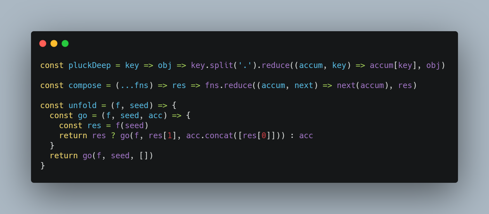

# HTML

## 谈一谈元素属性 href 和 src 的区别？

## 什么是标签语义化

## doctype 的作用

## 块级标签都有哪些？

ssh root@192.168.31.90

编辑 vim ~/.ssh/config 文件添加以下内容

> Host houdunren
> Hostname 192.168.31.90
> Port 22
> User root

现在直接使用 ssh houdunren 就可以登录服务器了

# CSS

## rem 和 em 的区别

## 伪类和伪元素有什么区别？

## 为什么要清除浮动？如何清除？

## 不同选择器的权重怎么算的

## 前端几大经典布局的实现方案？

## toB 和 toC 的区别

## VUE 的性能优化

## 对 Vue3.0 的新特性有没有了解？

## 移动端布局的几大方案？

## css 的 display 可以取什么值？

## 用 ts 实现一个数组的去重

## mvvm 框架原理

## 手写 promise 的实现

## 移动端布局的几大方案？

## flex 布局和传统布局的区别

## http 各种状态码的含义

## 什么时候用 flex ？除了这种方式居中还能用什么？响应式布局还能怎么做？盒子模型？

## opacity 兼容处理？

> 上面的操作也已经实现的 VSCODE 远程开发的基础步骤

## 介绍一下 postion 属性

## CSS 中 link 和 import 的区别

- link 属于 HTML 标签，@import 是 CSS 提供的
- 页面被加载的时候 link 就会被加载，而 @import 需要等到页面加载完才会加载
- import 只能在 IE5 以上使用，link 是 HTML 标签，无兼容问题
- link 的权重高于 @import

#配置源

## filter 还能做哪些事？

通过添加源可以加快软件下载，同时更多的源也提供更丰富的软件

如果下载速度可以就不用配置了

---

## 盒子水平垂直居中的方案？

这个问题在项目中很常见，开始我用的什么。。 
后来 css3 出现，我尝试用什么。。。 
后来我在博客上看到了还有什么什么技术。。于是尝试使用。。 

##### 记住一共有五中方案

- 定位三种
- display：flex
- javascript
- display：table-cell

###### 1、定位

`box{ width:100px;height:50px; position:absolute; top:50%; left:50%;margin-top:-25px;margin-left:-50px; }`

## 不同选择器的权重怎么算的

## 说一说盒模型吧

## position 和 float 的区别？

## CSS 怎么画出一个三角形

## 旋转动画怎么做？

## rem 和 em 的区别

CENTOS 8

# JavaScript

## 复制一个数组有哪些方法？哪个方法最好

## cdn 的作用和原理？

## 响应式的浏览器原理？

## async await 原理？

## 了解 vue-lazyloader 吗

## 如何判断一个类型是数组？instanceOf 实现？

## 提交表单有哪些常用方法？应用层通信层发生了哪些过程？

## let、const 及 var 的区别？

## 解构赋值和拓展运算符

## Set/Map 数据结构

## null 和 undefined 有什么区别

## 事件委托是什么？主要解决什么问题？

## 了解基本的数据类型吗

## Promise 设计模式？

## 移动端的触摸事件了解吗

cd /etc/yum.repos.d

## Interator 迭代器

## 闭包怎么理解？项目中用到过吗

## 一般怎么判断基本的数据类型

## 普通函数和构造函数的区别

## 深拷贝一个数组怎么做

## async / await 及实现原理

## 了解 return 吗？

## AJAX 核心四步操作？交互过程？

#备份旧源数据
sudo cp CentOS-Base.repo CentOS-Base.repo.bak
sudo cp CentOS-AppStream.repo CentOS-AppStream.repo.bak
sudo cp CentOS-Extras.repo CentOS-Extras.repo.bak

## 底层运行机制：微任务宏任务和事件循环机制

## Generator 生成器函数

## 手写懒加载函数

## 说一下原型链吧（proto，prototype）

## JS 底层运行机制：单线程和同步异步编程

## 了解作用域吗？怎么预防作用域污染

## 堆栈内存的理解

## 箭头函数和普通函数的区别

## 说一下拷贝对象吧，深拷贝浅拷贝

## fetch 基础和实战

## 谈一谈变量提升？

## json 的数据格式都介绍一下

## JS 是否了解过函数式编程

## 跨域怎么处理？都知道什么方法？ jsonp 和 cors 哪个更安全

## 异步的处理方式？都是怎么处理的

sudo sed -i 's/mirrorlist=/#mirrorlist=/g' CentOS-Base.repo CentOS-AppStream.repo CentOS-Extras.repo
sudo sed -i 's/#baseurl=/baseurl=/g' CentOS-Base.repo CentOS-AppStream.repo CentOS-Extras.repo
sudo sed -i 's/http:\/\/mirror.centos.org/https:\/\/mirrors.aliyun.com/g' CentOS-Base.repo CentOS-AppStream.repo CentOS-Extras.repo

yum makecache

CENTOS 7

# Vue

## 双向绑定原理是怎么实现的？

## Vue 和 Vuex 的差异？

## Vue 设计原则的理解？

## vue 从 data 改变到页面渲染的过程

## 如果没有 vue-router，你们还会做单页面应用吗

## Vuex 的触发过程 （actions，state，view）？

## 关于 VUE 的性能优化

## 双向绑定原理？

## 组件的设计原则

## 对 flutter 的了解

## 讲一下 vue 有哪些特性

## 谈谈对 Vue 组件化的理解

## 为什么使用 vue 框架而不是使用其他框架

## vue 中 key 的作用？说说对它的理解

## 对 Vue 源码了解吗

## vue 里的虚拟 dom 是怎么回事

## Vue 的设计思路有了解吗

# 计算机和浏览器原理

## 如何保证浏览器不受脚本的恶意攻击

---

## 浏览器渲染页面的过程

## 浏览器输入 URL 到整个页面渲染出来经历的过程详细讲解一下

# 网络协议

## http 和 https 有什么区别？比如性能方面

## http 的请求头都包括哪些？

## OSI 七层协议？

## dns 劫持是什么？

## 304 状态码的理解？

## 移动端 300 毫秒延迟怎么解决？

## https 讲一下过程

## 移动端点击穿透

## TCP 和 UDP 的区别？TCP 怎样保证传输可靠

## http2.0 了解多少

## http 各种状态码的含义

# Getting Started

# 其他

## 做微信小程序有什么亮点，什么难点？

## 用户反馈进入页面白屏，如何排查错误

## 你在团队中的优势是什么？尤其是技术方面

## 前端性能优化？

## 登陆注册的前后端处理机制

## 加密策略 encodeURI-Component 和 MD5

## 存储方案 cookie、webStorage、session 等

## 用户权限和登陆的校验处理

## 常见的排序方法？都熟悉哪些

## 做 PC 端多一些还是移动端多一些？遇到了什么难以解决的兼容性问题？

## nodejs 用过吗？

## 同一个对象上绑定了多个事件，执行顺序是怎样的

## 正则表达式的使用程度

## vue 的生命周期讲一下

## token 的校验处理

## 有遇到过跨域问题吗？跨域的原理是什么

## 谈谈对 MVC、MVP、MVVM 的理解？

## 前端缓存了解多少？分为哪几类

## 对 SEO 有什么了解

## 前端鉴权了解过吗？

## 设计模式了解多少？

## 快速排序的思路是怎样的

## 对 JS 单线程的理解

## 事件模型能介绍一下吗

## 原型链理解多少？

## 对算法了解怎么样？常用的排序算法？

## 讲一下性能优化？具体哪些优化的收益更大一些

This header won't appear in the sidebar table of contents.
sudo cp /etc/yum.repos.d/CentOS-Base.repo /etc/yum.repos.d/CentOS-Base.repo.bak

sudo wget -O /etc/yum.repos.d/CentOS-Base.repo http://mirrors.aliyun.com/repo/Centos-7.repo

sudo rpm -import http://mirrors.aliyun.com/centos/RPM-GPG-KEY-CentOS-7
sudo rpm -Uvh http://mirrors.aliyun.com/epel/epel-release-latest-7.noarch.rpm
sudo sudo rpm -import http://mirrors.aliyun.com/epel/RPM-GPG-KEY-EPEL-7
sudo rpm -import http://mirrors.aliyun.com/epel/RPM-GPG-KEY-EPEL-7Server
sudo yum install -y yum-axelget

#防火墙
在学习阶段可以先关闭防火墙，保证端口不受访问限制，以下是 LINUX 管理防火墙的基本指令

sudo systemctl stop firewalld.service

练习时也可以永久关闭防火墙

sudo systemctl disable firewalld.service

查看防火墙状态

sudo systemctl status firewalld.service

关闭 setlinux

修改配置文件

sudo vim /etc/selinux/config

修改 SELINUX 值为 disabled，永久有效但需要重起系统

SELINUX=disabled

可以执行以下命令，立刻生效（建议和上面命令一起使用）

setenforce 0

#基本操作
关机重起

#关机
init 0

#重起系统
reboot

查看版本

cat /etc/redhat-release

语言支持

如果安装软件时提示 Failed to set locale, defaulting to C 或中文出现乱码，是因为在安装时没有选择设置 language support 语言支持选项，下面是安装后的调整方法

编辑语言文件

vim /etc/profile.d/lang.sh

设置以下内容

export LANG=en_US.UTF-8
export LANGUAGE=en_US.UTF-8
export LC_COLLATE=C
export LC_CTYPE=en_US.UTF-8

重新加载配置

source /etc/profile.d/lang.sh
